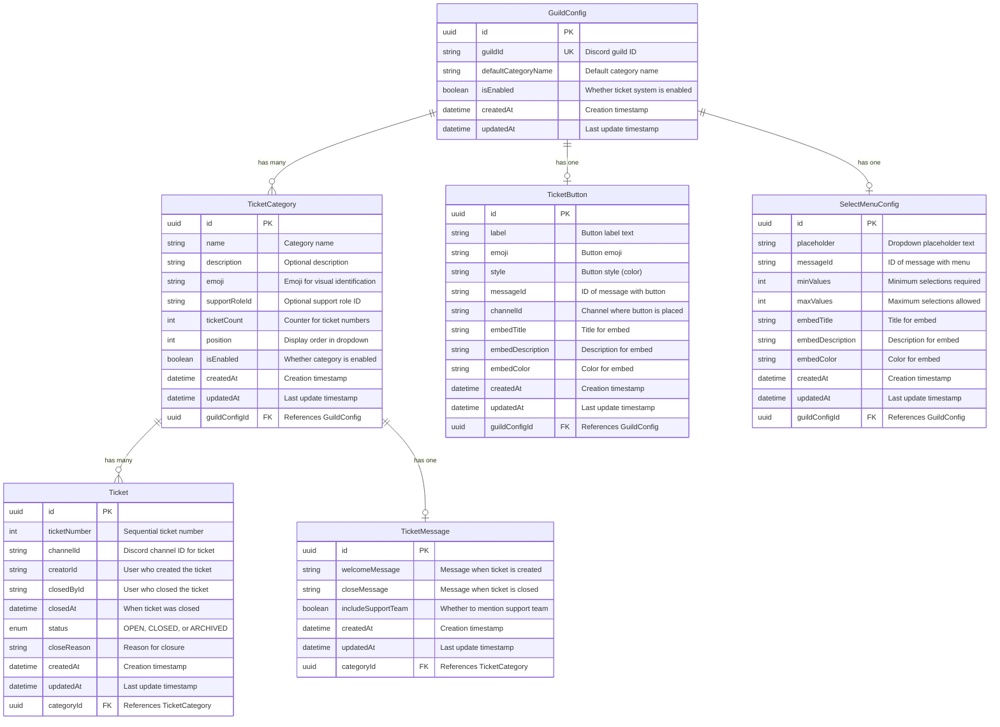

# Salt

## Ticket Data model

```mermaid
erDiagram
    GuildConfig ||--o{ TicketCategory : "has many"
    GuildConfig ||--o| TicketButton : "has one"
    GuildConfig ||--o| SelectMenuConfig : "has one"
    TicketCategory ||--o{ Ticket : "has many"
    TicketCategory ||--o| TicketMessage : "has one"

    GuildConfig {
        uuid id PK
        string guildId UK "Discord guild ID"
        string defaultCategoryName "Default category name"
        boolean isEnabled "Whether ticket system is enabled"
        datetime createdAt "Creation timestamp"
        datetime updatedAt "Last update timestamp"
    }

    TicketCategory {
        uuid id PK
        string name "Category name"
        string description "Optional description"
        string emoji "Emoji for visual identification"
        string supportRoleId "Optional support role ID"
        int ticketCount "Counter for ticket numbers"
        int position "Display order in dropdown"
        boolean isEnabled "Whether category is enabled"
        datetime createdAt "Creation timestamp"
        datetime updatedAt "Last update timestamp"
        uuid guildConfigId FK "References GuildConfig"
    }

    Ticket {
        uuid id PK
        int ticketNumber "Sequential ticket number"
        string channelId "Discord channel ID for ticket"
        string creatorId "User who created the ticket"
        string closedById "User who closed the ticket"
        datetime closedAt "When ticket was closed"
        enum status "OPEN, CLOSED, or ARCHIVED"
        string closeReason "Reason for closure"
        datetime createdAt "Creation timestamp"
        datetime updatedAt "Last update timestamp"
        uuid categoryId FK "References TicketCategory"
    }

    TicketMessage {
        uuid id PK
        string welcomeMessage "Message when ticket is created"
        string closeMessage "Message when ticket is closed"
        boolean includeSupportTeam "Whether to mention support team"
        datetime createdAt "Creation timestamp"
        datetime updatedAt "Last update timestamp"
        uuid categoryId FK "References TicketCategory"
    }

    TicketButton {
        uuid id PK
        string label "Button label text"
        string emoji "Button emoji"
        string style "Button style (color)"
        string messageId "ID of message with button"
        string channelId "Channel where button is placed"
        string embedTitle "Title for embed"
        string embedDescription "Description for embed"
        string embedColor "Color for embed"
        datetime createdAt "Creation timestamp"
        datetime updatedAt "Last update timestamp"
        uuid guildConfigId FK "References GuildConfig"
    }

    SelectMenuConfig {
        uuid id PK
        string placeholder "Dropdown placeholder text"
        string messageId "ID of message with menu"
        int minValues "Minimum selections required"
        int maxValues "Maximum selections allowed"
        string embedTitle "Title for embed"
        string embedDescription "Description for embed"
        string embedColor "Color for embed"
        datetime createdAt "Creation timestamp"
        datetime updatedAt "Last update timestamp"
        uuid guildConfigId FK "References GuildConfig"
    }
```
